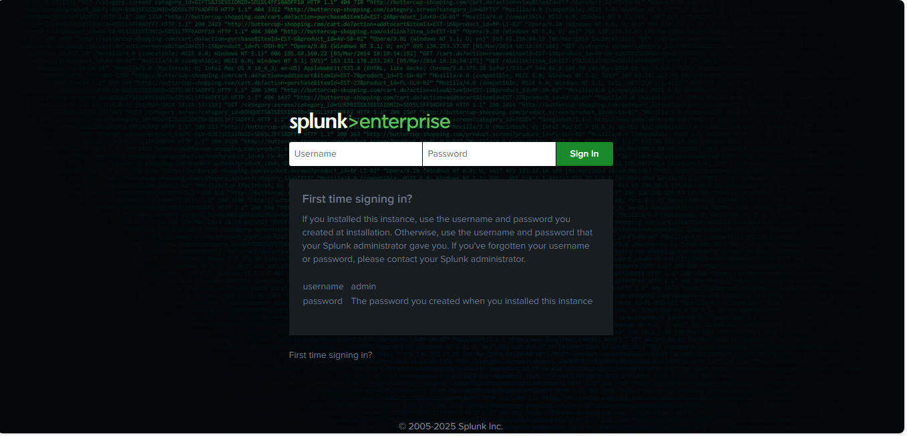
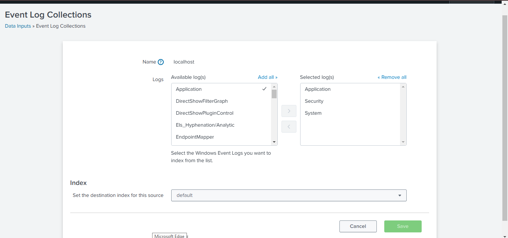
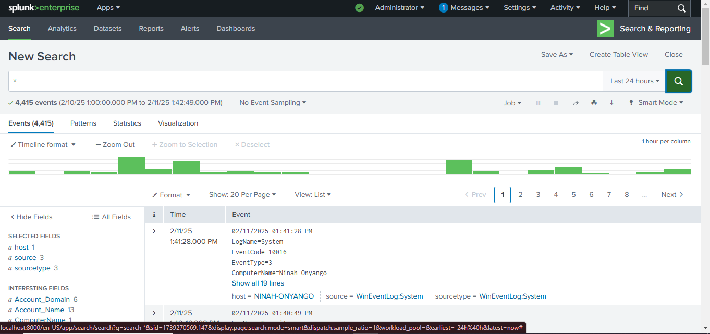
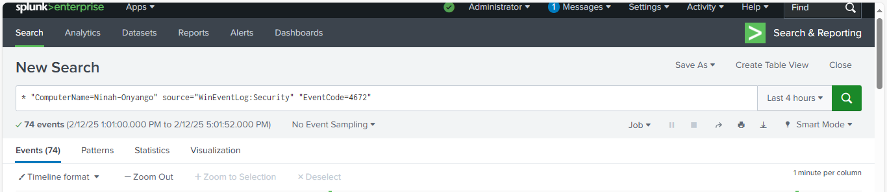
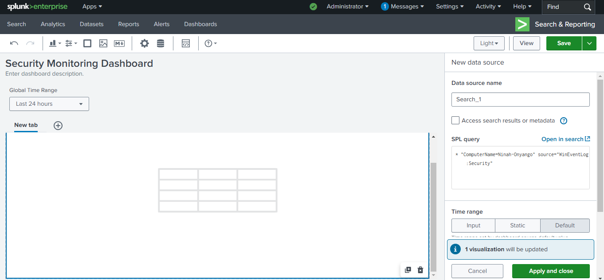
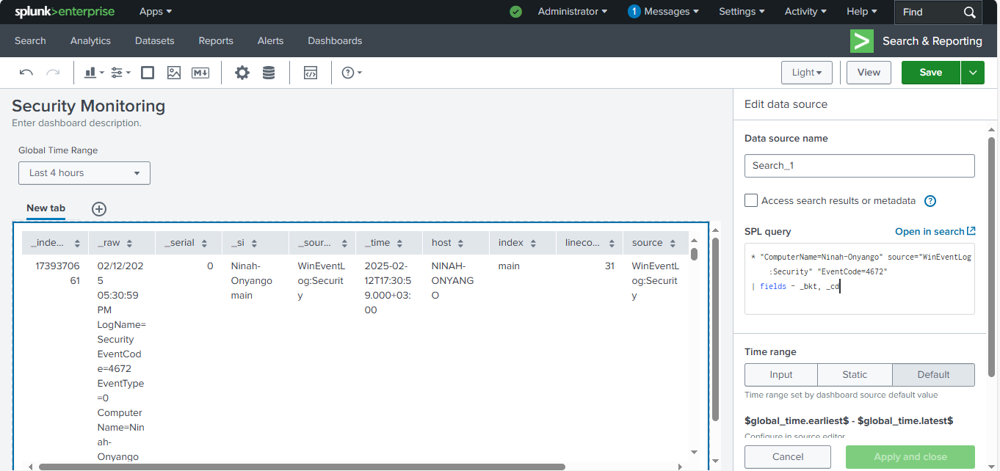
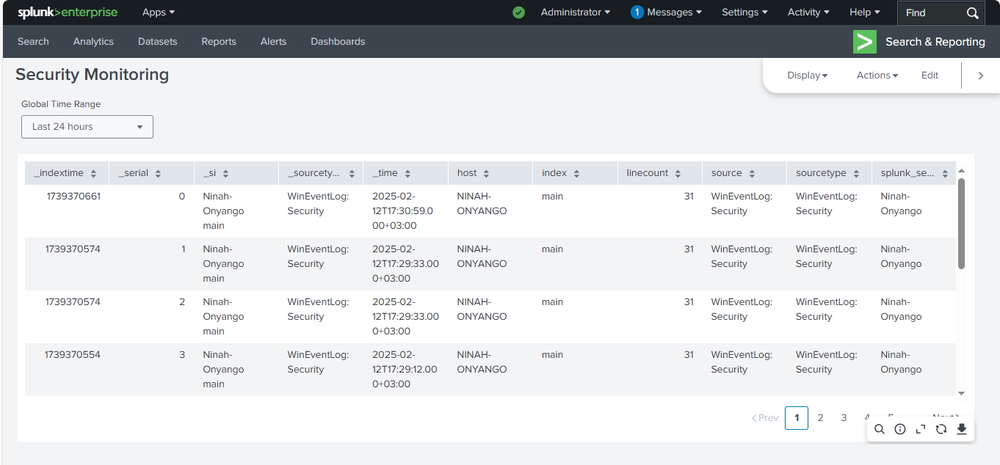

  GNU nano 8.2                                                                               README.md
# 🔍 

## 🛠 Tools Used:
- Splunk Enterprise
- Windows Event Logs

## 🎯 Objective:
- Monitor and analyze Windows Security Logs using Splunk Enterprise.
- Detect suspicious activities such as failed login attempts, account lockouts and malware detections.
- Build up a security dashboard for real-time monitoring.

## 📖 Steps Taken:
1. Installed and launched Splunk Enterprise on Windows.
2. Logged in to Splunk Web Interface: http://localhost:8000 using admin credentials created at installation.
3. Configured Windows Security Event Logs as a data source to collect and ingest Logs.

     Settings > Data Inputs
     Add Windows Event Logs (WinEventLog://Security)
     *Once logs are ingested, create visualizations.*

4. Created Splunk search using Splunk's (SPL) Search Processing Language to detect securitu events.
5. Designed a security monitoring dashboard to visualize threats.
6. Documented the findings. 

## 📸 Screenshots: 

## 📝 Findings:

## 🚀 Key Takeaways:
-Splunk Enterprise is an effective SIEM tool for Windows security monitoring.
-Security Event Logs provide valuable insights into authentication and malware-related activities.
-Dashboards and alerts can help in real-time threat detection and response.
-Organizations should integrate Splunk with other security tools to enhance visibility and automation.
