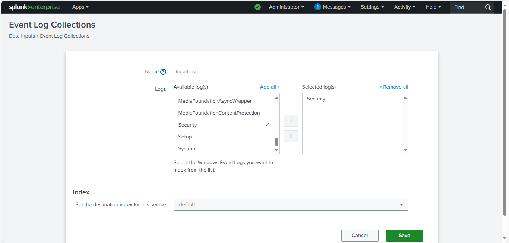
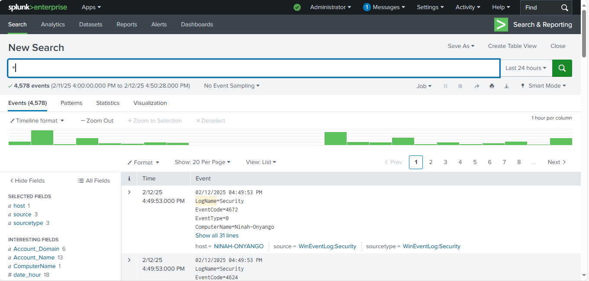
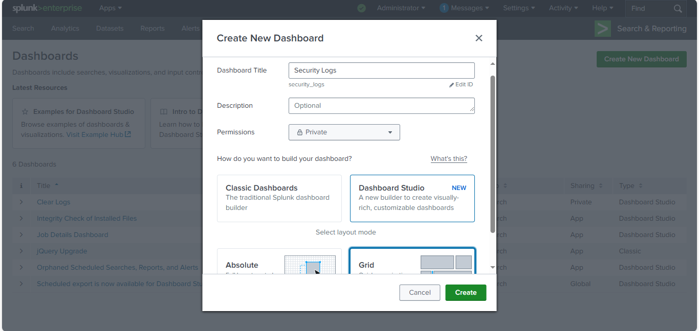

# 🔍 

## 🛠 Tools Used:
- Splunk Enterprise
- Windows Event Logs

## 🎯 Objective:
- Monitor and analyze Windows Security Logs using Splunk Enterprise.
- Detect suspicious activities such as failed login attempts, account lockouts and malware detections.
- Build up a security dashboard for real-time monitoring.

## 📖 Steps Taken:
1. Installed and launched Splunk Enterprise on Windows.
2. Logged in to Splunk Web Interface: http://localhost:8000 using admin credentials created at installation.
3. Configured Windows Security Event Logs as a data source to collect and ingest Logs.

     Settings > Data Inputs
     Add Windows Event Logs (WinEventLog://Security)
     *Once logs are ingested, create visualizations.*

4. Created Splunk search using Splunk's (SPL) Search Processing Language to detect securitu events.
5. Designed a security monitoring dashboard to visualize threats.
6. Documented the findings. 

## 📸 Screenshots: 
*Splunk Login page: Logged in using admin credentials created at installation.*

*Configured Windows Security Event Logs as a data source.*

*Used the Wildcard Search* : (*)

*This query retrieves all events within the specified time range (Last 24 hours).*
*It is not filtering logs based on specific fields, sources, or event types.*

*Refined the Search Query: Instead of retrieving all logs, filter for*
*security-related events like login failures or system warnings.*
          

*Creation of the Security Monitoring dashboard*

*Table view of the Security Monitoring dashboard.*

*The newly created Security Monitoring dashboard has been added on the main dashboard page.*

*The Security Monitoring dashboard*

## 📝 Findings:
1. *<b>Results Overview:</b>*

- Total Events: 4,578 logs were retrieved.
- Time Range: From 2/11/25 4:00:00 PM to 2/12/25 4:50:28 PM.
- Log Source: WinEventLog:Security (Windows Security Logs).
- Highlighted Event:
- EventCode=14672
- LogName=Security
- EventType=3
- ComputerName=Ninah-Onyango

2. *<b>Event Overview of first Security Log:</b>*

- 02/12/2025 07:45:55 PM
- LogName=Security
- EventCode=4672
- EventType=0
- ComputerName=Ninah-Onyango
- SourceName=Microsoft Windows security auditing.
- Type=Information
- RecordNumber=181984
- Keywords=Audit Success
- TaskCategory=Special Logon
- OpCode=Info
- Message=Special privileges assigned to new logon.

- Subject:
 	Security ID:		S-1-5-18
 	Account Name:		SYSTEM
 	Account Domain:		NT AUTHORITY
 	Logon ID:		0x3E7

- Privileges:		SeAssignPrimaryTokenPrivilege
 			- SeTcbPrivilege
			SeSecurityPrivilege
			SeTakeOwnershipPrivilege
			SeLoadDriverPrivilege
			SeBackupPrivilege
			SeRestorePrivilege
		     SeDebugPrivilege
		     SeAuditPrivilege
	     	SeSystemEnvironmentPrivilege
			SeImpersonatePrivilege
			SeDelegateSessionUserImpersonatePrivilege	

3. *<b>Event Analysis of first Security Log (in (2) above)</b>*

## What This Event Means
Event ID 4672 is logged when an account with admin-equivalent privileges logs into the system.
The "Special Logon" indicates that the system granted elevated privileges to the account.
The account in question is SYSTEM (S-1-5-18, NT AUTHORITY), which is a built-in Windows system account used by the OS and services.

## Security Analysis
🔍 Is this normal behavior?

If this event appears frequently and aligns with normal system startup or scheduled tasks, it is likely expected behavior.
However, if it occurs unexpectedly or is linked to a user account, it may indicate malicious activity.
🛑 Red Flags to Investigate
✅ Unexpected Logon Time:

If you weren’t performing an admin-related task, this could be suspicious.
✅ Frequency of Event 4672:

If this event occurs frequently in a short period, it may indicate repeated privilege elevation attempts.

## 🚀 Key Takeaways:
- Splunk Enterprise is an effective SIEM tool for Windows security monitoring.
- Security Event Logs provide valuable insights into authentication and malware-related activities.
- Dashboards and alerts can help in real-time threat detection and response.
- Organizations should integrate Splunk with other security tools to enhance visibility and automation.
