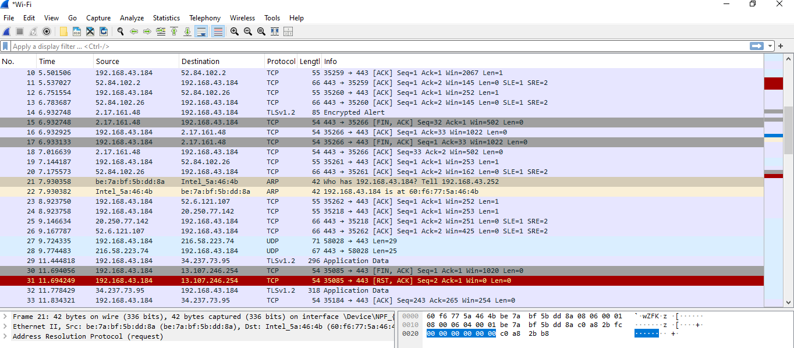
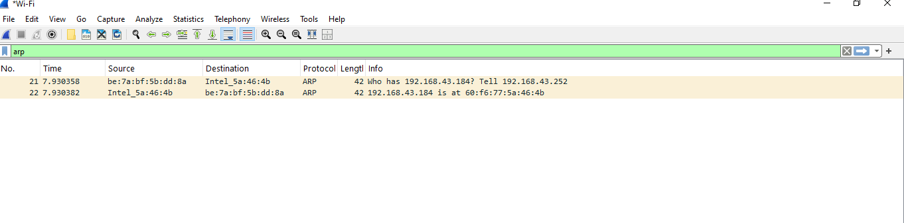

# 🔍 

## 🛠 Tools Used:
- Wireshark
- Windows

## 🎯 Objective:
- Capture and documenting ARP traffic in Wireshark, and understand its role in networking

## 📖 Steps Taken:
1. Started Wireshark on `Wi-Fi` interface.
2. Captured packets using the filter: `ARP`
3. Observed ARP Request and Reply packets.

## 📝 Findings:
- Normal ARP Behavior
1. ARP is used to map IP addresses to MAC addresses within a local network.
2. ARP Requests are broadcasted (sent to all devices on the network).
3. ARP Replies are unicast (sent only to the requester).
4. The ARP cache stores resolved addresses for a short period to reduce network traffic.
     
     Device A: "Who has 192.168.43.184? Tell 192.168.43.252" (ARP Request)
     Device B: "192.168.43.184 is at 60:f6:77:5a:46:4b" (ARP Reply)

## 📸 Screenshots:

## 🚀 Key Takeaways:
- Wireshark is a powerful network analysis tool.
- Organizations must implement ARP security measures to prevent spoofing attacks in enterprise networks.
- ARP is a foundational protocol, but it lacks built-in security.
- Attackers can exploit ARP spoofing to perform on-path attacks.
- Implementing security measures like DAI, static ARP tables, and VLAN segmentation can protect networks.

